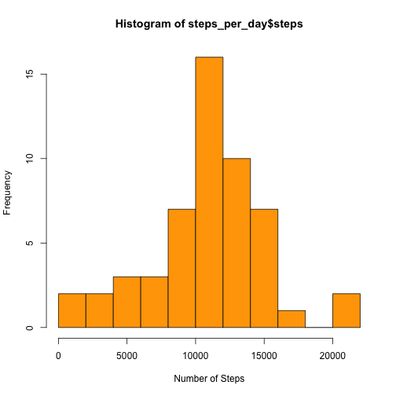
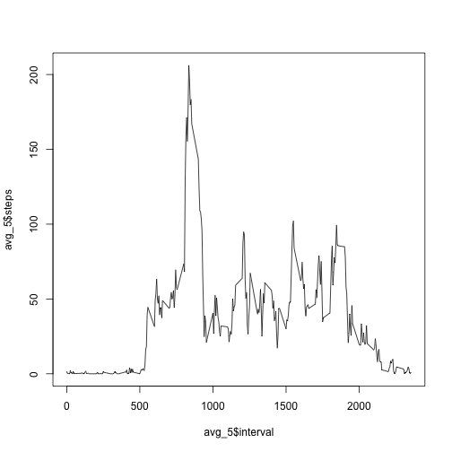
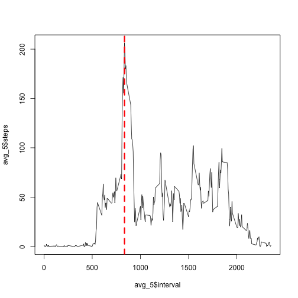
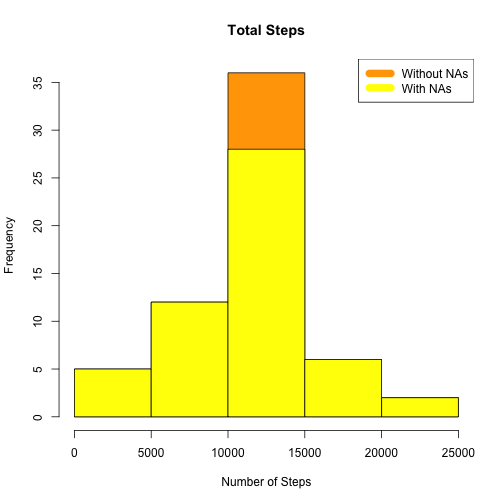
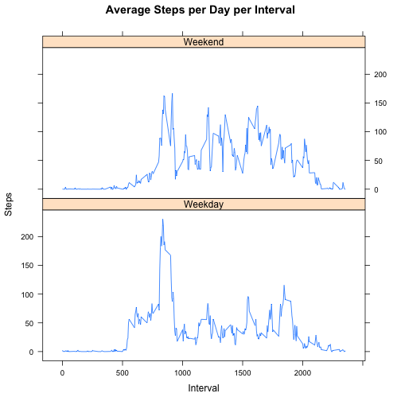

## Required Libraries

```r
library(dplyr)
library(lubridate)
library(lattice)
```

## Loading and preprocessing the data

### 1. Load the data (i.e. read.csv())

```r
data <- read.csv("activity.csv")                                                # Reading data from file
```

### 2. Process/transform the data (if necessary) into a format suitable for your analysis

```r
data <- as_tibble(data)                                                         # Convertind data frame to tibble
data$date<-as.Date(data$date, "%Y-%m-%d")                                       # Formatting date variable to correct type
```

## What is total number of steps taken per day?
For this part of the assignment, you can ignore the missing values in the dataset.

```r
steps_per_day <- aggregate(steps ~ date, data, sum)
steps_per_day
```

```
##          date steps
## 1  2012-10-02   126
## 2  2012-10-03 11352
## 3  2012-10-04 12116
## 4  2012-10-05 13294
## 5  2012-10-06 15420
## 6  2012-10-07 11015
## 7  2012-10-09 12811
## 8  2012-10-10  9900
## 9  2012-10-11 10304
## 10 2012-10-12 17382
## 11 2012-10-13 12426
## 12 2012-10-14 15098
## 13 2012-10-15 10139
## 14 2012-10-16 15084
## 15 2012-10-17 13452
## 16 2012-10-18 10056
## 17 2012-10-19 11829
## 18 2012-10-20 10395
## 19 2012-10-21  8821
## 20 2012-10-22 13460
## 21 2012-10-23  8918
## 22 2012-10-24  8355
## 23 2012-10-25  2492
## 24 2012-10-26  6778
## 25 2012-10-27 10119
## 26 2012-10-28 11458
## 27 2012-10-29  5018
## 28 2012-10-30  9819
## 29 2012-10-31 15414
## 30 2012-11-02 10600
## 31 2012-11-03 10571
## 32 2012-11-05 10439
## 33 2012-11-06  8334
## 34 2012-11-07 12883
## 35 2012-11-08  3219
## 36 2012-11-11 12608
## 37 2012-11-12 10765
## 38 2012-11-13  7336
## 39 2012-11-15    41
## 40 2012-11-16  5441
## 41 2012-11-17 14339
## 42 2012-11-18 15110
## 43 2012-11-19  8841
## 44 2012-11-20  4472
## 45 2012-11-21 12787
## 46 2012-11-22 20427
## 47 2012-11-23 21194
## 48 2012-11-24 14478
## 49 2012-11-25 11834
## 50 2012-11-26 11162
## 51 2012-11-27 13646
## 52 2012-11-28 10183
## 53 2012-11-29  7047
```

### Make a histogram of the total number of steps taken each day

```r
steps_per_day<-aggregate(steps~date,data,sum)
hist(steps_per_day$steps,breaks = 10, col = "orange", xlab = "Number of Steps") # Ploting histogram of total steps per day
```



### Calculate and report the mean and median total number of steps taken per day

```r
mean_steps_per_day <- mean(steps_per_day$steps)                                 # Mean number of steps per day
median_steps_per_day <- median(steps_per_day$steps)                             # Median number of steps per day
paste("Mean of number of steps per day is:", mean_steps_per_day, ", and median of steps per day is:", median_steps_per_day)
```

```
## [1] "Mean of number of steps per day is: 10766.1886792453 , and median of steps per day is: 10765"
```

### What is the average daily activity pattern?
Make a time series plot (i.e. type = "l") of the 5-minute interval (x-axis) and the average number of steps taken, averaged across all days (y-axis)

```r
avg_5 <- aggregate(steps~interval, data , mean, na.rm = TRUE)       # 5- minute interval average
plot(avg_5$interval, avg_5$steps, type = "l")                                   # Ploting line chart of avg_5
```



### Which 5-minute interval, on average across all the days in the dataset, contains the maximum number of steps?

```r
max_avg_5<-filter(avg_5,avg_5$steps==max(avg_5$steps))[[1]]                     # Filtering for interval with maximum number of steps
paste("Maximum number of steps within 5 minutes interval is:",max_avg_5)
```

```
## [1] "Maximum number of steps within 5 minutes interval is: 835"
```

```r
plot(avg_5$interval, avg_5$steps, type = "l")                                   # Ploting line chart of avg_5
abline(v=max_avg_5,col="red", lwd=3, lty=2)
```



## Imputing missing values
Note that there are a number of days/intervals where there are missing values (coded as NA). The presence of missing days may introduce bias into some calculations or summaries of the data.

### Calculate and report the total number of missing values in the dataset (i.e. the total number of rows with NAs)


```r
NA_values<-sum(!complete.cases(data))                                           # Calculating number of NA values
paste("Total number of NA values is:", NA_values)
```

```
## [1] "Total number of NA values is: 2304"
```

### Devise a strategy for filling in all of the missing values in the dataset. The strategy does not need to be sophisticated. 
For example, you could use the mean/median for that day, or the mean for that 5-minute interval, etc. Create a new dataset that is equal to the original dataset but with the missing data filled in.


```r
StepsAverage <- aggregate(steps ~ interval, data = data, FUN = mean)
fillNA <- numeric()
for (i in 1:nrow(data)) 
        {
        obs <- data[i, ]
                if (is.na(obs$steps)) 
                        {
                        steps <- subset(StepsAverage, interval == obs$interval)$steps
                        } 
                else 
                        {
                        steps <- obs$steps
                        }
                fillNA <- c(fillNA, steps)
        }
new_data<-data
new_data$steps<-fillNA
```

Make a histogram of the total number of steps taken each day and Calculate and report the mean and median total number of steps taken per day. 

```r
StepsTotal <- aggregate(steps ~ date, data = new_data, sum, na.rm = TRUE)
hist(StepsTotal$steps, main = paste("Total Steps"), col="orange", xlab="Number of Steps")

hist(steps_per_day$steps, main = paste("Total Steps Each Day"), col="yellow", xlab="Number of Steps", add=T)
legend("topright", c("Without NAs", "With NAs"), col=c("orange", "yellow"), lwd=10)
```



Do these values differ from the estimates from the first part of the assignment? What is the impact of imputing missing data on the estimates of the total daily number of steps?


```r
rmeantotal <- mean(StepsTotal$steps)
paste("Mean without NAs:",rmeantotal)
```

```
## [1] "Mean without NAs: 10766.1886792453"
```

```r
rmediantotal <- median(StepsTotal$steps)
paste("Median without NAs:",rmediantotal)
```

```
## [1] "Median without NAs: 10766.1886792453"
```

```r
rmean <- mean(steps_per_day$steps)
paste("Mean with NAs:",rmean)
```

```
## [1] "Mean with NAs: 10766.1886792453"
```

```r
rmedian <- median(steps_per_day$steps)
paste("Median with NAs:",rmedian)
```

```
## [1] "Median with NAs: 10765"
```

```r
rmediandiff <- rmediantotal - rmedian
paste("Median difference:",rmediandiff)
```

```
## [1] "Median difference: 1.1886792452824"
```

```r
rmeandiff <- rmeantotal - rmean
paste("Mean difference:",rmeandiff)
```

```
## [1] "Mean difference: 0"
```

### Are there differences in activity patterns between weekdays and weekends?
For this part the weekdays() function may be of some help here. Use the dataset with the filled-in missing values for this part. Create a new factor variable in the dataset with two levels -- "weekday" and "weekend" indicating whether a given date is a weekday or weekend day.


```r
weekdays <- c("Monday", "Tuesday", "Wednesday", "Thursday", 
              "Friday")
new_data$dow = as.factor(ifelse(is.element(weekdays(as.Date(new_data$date)),weekdays), "Weekday", "Weekend"))
StepsTotal <- aggregate(steps ~ interval + dow, new_data, mean)
```


Make a panel plot containing a time series plot (i.e. type = "l") of the 5-minute interval (x-axis) and the average number of steps taken, averaged across all weekday days or weekend days (y-axis). The plot should look something like the following, which was created using simulated data:

Sample panel plot

```r
xyplot(StepsTotal$steps ~ StepsTotal$interval|StepsTotal$dow, main="Average Steps per Day per Interval",xlab="Interval", ylab="Steps",layout=c(1,2), type="l")
```


